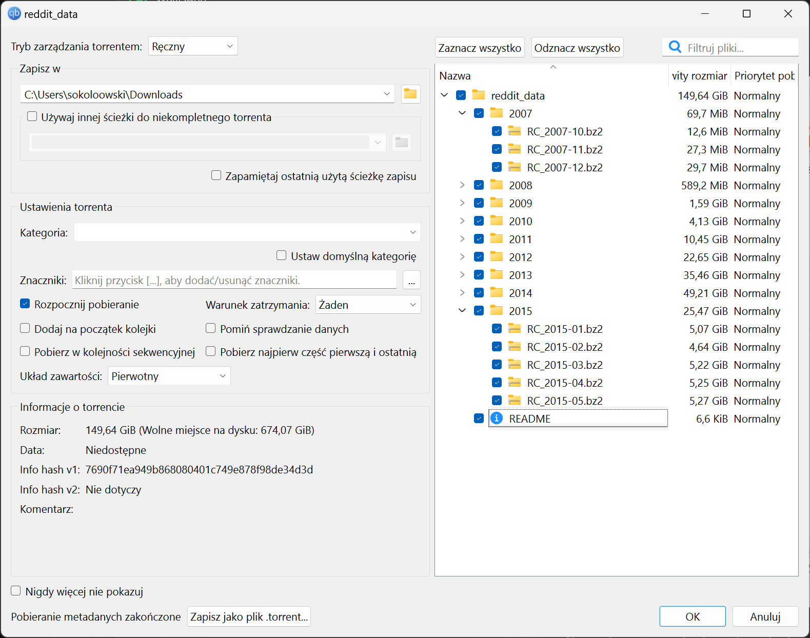
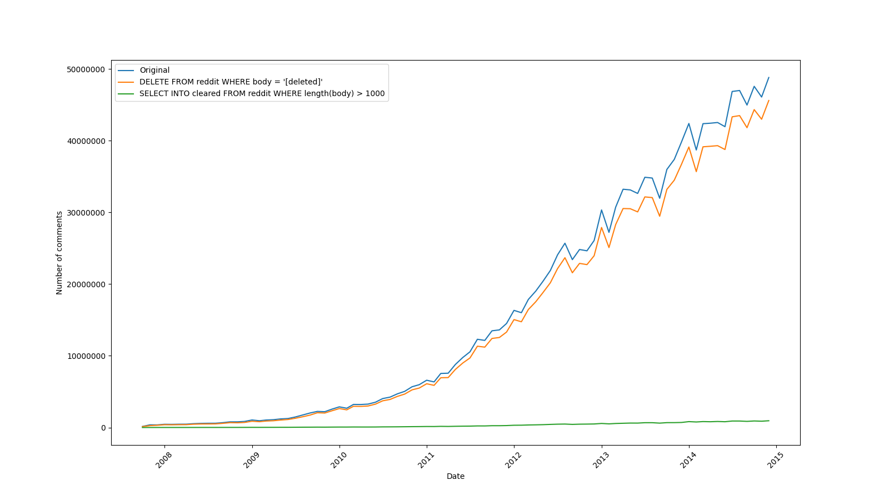

# [Advanced data mining docs](README.md) - dataset

---

- [reddit datasets](https://www.reddit.com/r/datasets/comments/3bxlg7/i_have_every_publicly_available_reddit_comment/)



---

Zebrany przez nas zbiór danych to komentarze z serwisu Reddit. Ze względu na politykę serwisu, z poziomu API możliwe jest pobranie zaledwie 100 ostatnich wpisów, posłużyliśmy się więc [publicznie dostępnym zbiorem komentarzy](https://www.reddit.com/r/datasets/comments/3bxlg7/i_have_every_publicly_available_reddit_comment/), który wg autora zawiera 1.7 mld rekordów.

Dane w ww. zbiorze podzielone są na pliki odpowiadające kolejnym miesiącom, w przedziale czasowym 10.2007 - 05.2015, z kolei każdy plik zawiera zapisane w formacie JSON informacje o wpisach - jedna linia na wpis. Przykładowy rekord:

```json
{
    "parent_id": "t3_5yba3",
    "created_utc": "1192450635",
    "ups": 1,
    "controversiality": 0,
    "distinguished": null,
    "subreddit_id": "t5_6",
    "id": "c0299an",
    "downs": 0,
    "archived": true,
    "link_id": "t3_5yba3",
    "score": 1,
    "author": "bostich",
    "score_hidden": false,
    "body": "test",
    "gilded": 0,
    "author_flair_text": null,
    "subreddit": "reddit.com",
    "edited": false,
    "author_flair_css_class": null,
    "name": "t1_c0299an",
    "retrieved_on": 1427426409,
    "removeal_reason": null
}
```

Każdy z wpisów zawiera 22 wartości określających takie właściwości jak:

- czas dodania,
- autora,
- wątek odpowiedzi,
- wątek tematyczny,
- treść,
- polubienia,
- czas edycji.

By uczynić analizę zbioru łatwiejszą, wpisy zostały umieszczone w bazie danych PostgreSQL. Na tym etapie zrezygnowaliśmy z analizy wpisów z 2015 roku, ze względu na pojawiające się niestandardowe właściwości wpisów.

Finalnie w naszej bazie znalazło się 1 393 016 403 rekordów.



Z pobieżnej analizy wynika, że niektóre pola nie są w ogóle używane (`downs`)
