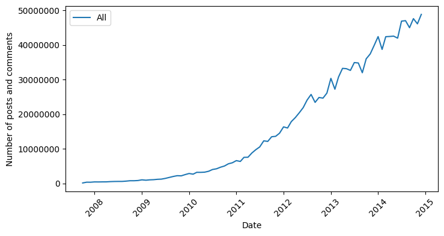

# Hardware limitation and the challenge of data acquisition {#sec:data-acquisition}

<!-- opisać pobieranie datasetu, przygotowanie skryptu, serwera bazy danych, oraz procesu ładowania danych do bazy -->

The dataset we found turned out to take up a lot of disk space. The download took more than 12 hours and took up 149.6 GiB of disk space. While unpacking the files, it turned out that we didn't have that much disk space - a compression ratio of 6.87:1 meant that we would need 1 TiB of disk space. Therefore, we decided to build a server using parts from old computers that were made available from our university's storage facility.

Admittedly, the resulting database server does not feature high performance, as it only has 16 GB of RAM and an Intel Core i7-6700K processor. However, we expanded it with additional hard drives, which, using LVM^[Logical Volume Manager], increased the disk space to about 3 TiB. It is also worth mentioning that the hardware is worn out, as it was previously used as a student workstation. Nevertheless, we decided to use it because it allowed us to store the entire data set.

Rocky Linux 9, an operating system based on Red Hat Enterprise Linux, was installed on the server. This distribution is the successor to the server-based CentOS and is characterized by very high stability. We chose PostgreSQL as the database management system, as it is a free and open system with high performance and scalability. It was run as a Docker container, which allowed easy management of the database and its resources.

After preparing the server for operation, we proceeded with the process of decompressing and loading the data into the database. The decompression was done using a bash script, in which we used the `lbzip2` tool. To load the decompressed data, we wrote a Python script, presented in [@lst:write-to-db], that reads lines from JSONL files, parses them and writes them to the database. This script uses the `psycopg2` library to communicate with the PostgreSQL database. The process took about 3 days due to the large amount of data and the server's hardware limitations, mainly disk read and write speeds.

```python
def to_timestamp(s: str) -> datetime:
  return datetime.fromtimestamp(int(s))

def insert_file(fp: str, cur: psycopg2.extensions.cursor):
  ret = 0
  cur.execute('BEGIN TRANSACTION;')
  with open(fp, "r") as f:
    for line in f:
      data = json.loads(line)

      created = to_timestamp(data['created_utc'])
      data['created_utc'] = created

      if data['edited']:
        edited = to_timestamp(data['edited'])
        data['edited'] = to_timestamp(data['edited'])
      else:
        data['edited'] = None
      
      if 'retrieved_on' in data.keys():
        retrieved = to_timestamp(data['retrieved_on'])
        data['retrieved_on'] = retrieved
      else:
        data['retrieved_on'] = None

      cur.execute(
        'INSERT INTO reddit (%s) VALUES %s', (
          AsIs(','.join(data.keys())), tuple(data.values())
        )
      )
      ret += 1

      if ret % 5000 == 0:
        print(f"\rProcessed {ret} rows...", end="")
  cur.execute('COMMIT;')
  print(f"\rProcessed {ret} rows from {fp}...")
  return ret
```

: Python function which parses JSONL files and writes them to the database {#lst:write-to-db}

We also encountered various errors due to inconsistent data structure in JSONL files. Some files were missing keys, others had additional values. As a result, we had to write a script that handles these cases and writes only the correct data to the database. As a result, we abandoned the 2015 data, as the files containing errors were too large and would have taken too long to analyze.

{#fig:initial-comments-count width=80%}

In the end, there were more than 1.4 billion records in our database, which took up a total of 562.8 GiB of disk space.
