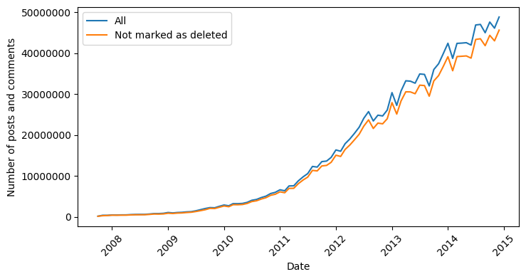
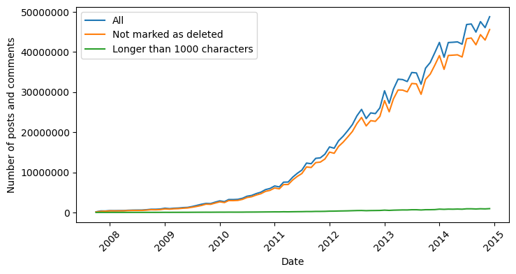
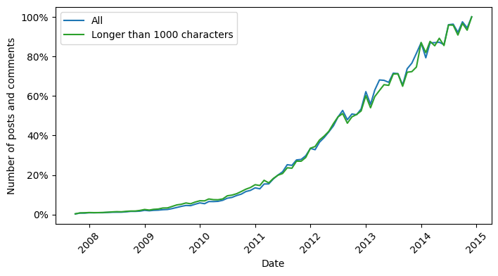

## Reducing Dataset Size at the Database Level

Initially, our plan was to remove all entries where either the author or the content was marked as deleted (indicated by `[deleted]`). However, we ultimately decided to retain as much content as possible. Thus, we kept the rows with a deleted author, removing only those where the content itself was marked as deleted. This reduction decreased our dataset by approximately 110 million rows, or around 8% of the total. Despite this, we were left with a massive dataset that remained challenging to search due to limited computing power.

{#fig:first-clean width=80%}

Next, we aimed to further reduce the dataset size by retaining only rows with more than 1,000 characters of content. To avoid losing valuable information, we applied this restriction selectively. The resulting dataset, saved in a new table via a `SELECT INTO` query, contained just under 27 million rows.

{#fig:second-clean width=80%}

It is important to note that the 1,000-character threshold we applied is relatively stringent, as shown in [@fig:second-clean]. For context, X (formerly Twitter) allows posts of up to 280 characters, with the majority of tweets averaging just 34 characters long [@twitter2017]. Despite this, we chose this limit intentionally, given the highly diverse vocabulary in our dataset. Our goal was to ensure that, even after removing stopwords, the core meaning of the posts remained intact.

Although not shown in [@fig:second-clean], the overall shape of the entry length distribution remained similar. A comparison of the graphs before and after cleaning is shown in [@fig:second-clean-distribution], where 100% represents the length of the longest entry. As illustrated, despite the significant reduction in entries, the general structure of the distribution stayed nearly the same.

{#fig:second-clean-distribution width=80%}

Due to hardware limitations, we decided to focus on a subset of five subreddits for further analysis: `politics`, `programming`, `science`, `gaming`, and `technology`. This selection was based on the prominence of these categories and their broad thematic diversity. As a result, we compiled a dataset of over 1.6 million entries, from which we randomly sampled 4,000 entries from each subreddit.
