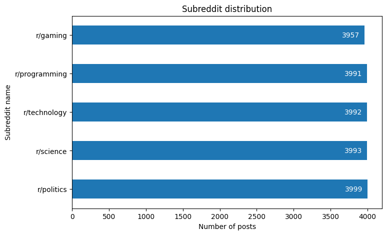

## Preprocessing {#sec:preprocessing}

Following the initial data filtering stage, we proceeded to process the data. The preparation of data for analysis represents a pivotal stage in the data mining process. In this instance, we elected to utilise a range of data processing techniques with a view to achieving optimal results for subsequent analysis.

The data was preprocessed in Python using the Pandas library for data manipulation [@reback2020pandas]. This facilitated the straightforward loading of data from a Postgres database, convenient processing and filtering, and the saving of the current progress to pickle files.

The initial processing stage involved the removal of duplicate rows, which could otherwise introduce errors into the subsequent analysis. Rows with identical values in both the `body` and `subreddit` columns were identified as duplicates. The `drop_duplicates` method was employed to address this issue, and the resulting analysis demonstrated that duplicates accounted for a mere 0.48% of the total rows.

The subsequent phase of the process entailed balancing and reducing the dataset. In this instance, the Pandas library was again leveraged, specifically the `sample` method, which permitted the selection of an equal number of rows for each category, as illustrated in [@lst:reduce-dataset]. This approach resulted in a dataset comprising 20,000 rows, thereby facilitating more expedient analysis.

```python
import pandas as pd

dataset_size = 20000
classes = df['subreddit'].unique()
subreddit_dfs = []

for subreddit in classes:
  _df = df[df['subreddit'] == subreddit]
  _df = _df.sample(dataset_size // len(classes))
  subreddit_dfs.append(_df)

df = pd.concat(subreddit_dfs).reset_index(drop=True)
```

: Reducing and balancing the dataset {#lst:reduce-dataset}

The subsequent phase of the investigation entailed the examination of the most prevalent lexical items within the dataset. To this end, the `CountVectorizer` from the Scikit Learn library [@sklearn2011] was employed, enabling the enumeration of word occurrences within the `body` column. The results of this analysis are presented in [@fig:top-words-initial]. Furthermore, an analysis of the length of the entries was conducted, which facilitated a more comprehensive understanding of the data structure. The results of this analysis are presented in [@fig:post-length-initial].

{#fig:top-words-initial}

Furthermore, the distribution of entry lengths within the dataset was examined. As illustrated in [@fig:post-length-initial], the most prevalent entries are approximately 1,000 characters in length, and the graph displays a hyperbolic shape.

{#fig:post-length-initial width=80%}

Following this analysis, it became evident that the necessary steps for processing the text included decoding special characters, removing stopwords and performing text lemmatisation. To facilitate the aforementioned operations, all lines written in a language other than English were removed from the collection. At the outset, the `langdetect` library was employed, which employs a non-deterministic approach to ascertain the language of the text in question. However, concerns were raised regarding the quality of the results. Consequently, an in-house function was developed based on the NLTK library [@bird2009natural] to address this issue. The function, presented in [@lst:detect-language], was designed to perform this task. It was decided that the occurrence of stopwords in each language should be checked and the highest one selected, thus enabling the language of the text to be determined with greater precision. Furthermore, our function proved to be slightly faster than the `langdetect` library, which is advantageous when processing large datasets. Following this optimisation and the application of dictionary comprehension, a more readable implementation of the function is presented in this article. After this operation, the collection decreased by 0.34%, and the language distribution is shown in [@fig:language-distribution].

```python
import nltk
from nltk.corpus import stopwords


def detect_language(text: str):
  text = text.lower()
  words_set: set[str] = set(nltk.wordpunct_tokenize(text))
  occurences: dict[str, int] = {}

  for lang in stopwords.fileids():
    if lang == 'hinglish':
      # Skip Hinglish, which include both
      # Hindi and English stopwords
      continue
    common = words_set.intersection(stopwords.words(lang))
    occurences[lang] = len(common)

  return max(occurences, key=occurences.get)
```

: Detecting language of the text using NLTK and stopwords {#lst:detect-language}

{#fig:language-distribution width=80%}

Following the removal of non-English entries, the dataset is no longer perfectly balanced. However, the resulting differences between classes, as illustrated in [@fig:subreddit-distribution], are sufficiently minor that they will not significantly impact the analysis results.

{#fig:subreddit-distribution width=80%}

In the subsequent phase of the process, we undertook the decoding of special characters, the removal of stopwords and the lemmatisation of the text. To achieve this, we once again utilised the NLTK library, which enabled us to complete these tasks in an efficient manner. To accomplish this, we developed the function presented in [@lst:preprocessing], which we then applied to our dataset via the `apply` method. The outcome of these operations is a dataset that is now suitable for further analysis.

```python
import nltk
from nltk.corpus import stopwords
from nltk.stem import WordNetLemmatizer

def preprocessing(text: str) -> str:
  sw: list = stopwords.words('english')
  lemmatizer = WordNetLemmatizer()
  pos_dict={'NOUN': 'n', 'VERB': 'v', 'ADJ': 'a', 'ADV': 'r'}

  # Initial cleaning: remove URLs, unescape HTML entities
  text = unescape(re.sub(r"http(s?)://\S+", '', text.lower()))

  # Remove stop words - first run
  text = [word for word in text.split() if word not in sw]
  text = ' '.join(text)

  # Tokenize the text
  tokens = nltk.word_tokenize(text)
  tokens = nltk.pos_tag(tokens, tagset='universal')

  result = []
  for token, pos in tokens:
    if token not in sw:
      # Map POS tag to first character lemmatize() accepts
      pos = pos_dict.get(pos, 'n')

      # Lemmatize the token
      token = lemmatizer.lemmatize(token, pos)

      # Remove non-alphabetic characters
      token = re.sub(r"[^a-z]", ' ', token).strip()
      if token:
        result.append(token)
  text = ' '.join(result)

  # Remove stop words - third run
  text = [word for word in text.split() if word not in sw]
  return ' '.join(text)
```

: Function, which preprocesses the text data {#lst:preprocessing}

The preprocessing stage has resulted in the elimination of unnatural strings from the list of the most frequently occurring words, as illustrated in [@fig:top-words-preprocessed]. It is evident that the most prevalent words are now those that are genuinely found in the English lexicon. However, it is also important to consider the least frequent words. As illustrated in [@fig:top-words-preprocessed-least], our dataset still comprises a considerable number of superfluous words that contribute no meaningful information, such as `abab` or `zoooombiiiiiiiieeee`.

{#fig:top-words-preprocessed}

{#fig:top-words-preprocessed-least}

To circumvent this issue, we opted to eliminate words that are not present in the Brown Corpus. An analysis of the least frequent words revealed that the dataset had been effectively cleaned up. However, in the process, a number of crucial words, including the proper names of technology, were inadvertently removed. This highlighted the need for an alternative approach to preserve the specialised vocabulary. Consequently, the decision was taken to reduce the number of words to 10,000, which not only enhanced the quality of the data but also allowed for the retention of non-word strings within the dataset.

Following the preprocessing stage, a notable alteration was observed in the histogram of the length of the entries, as illustrated in [@fig:post-length-removed-nonwords]. The most common post length is now approximately 700 characters, which represents a notable reduction from the initial 1,000 characters.

{#fig:post-length-removed-nonwords width=80%}
