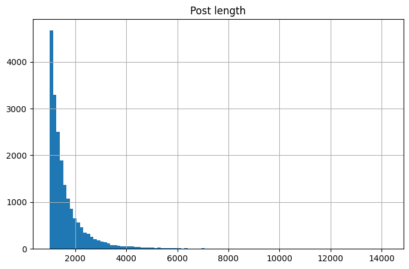
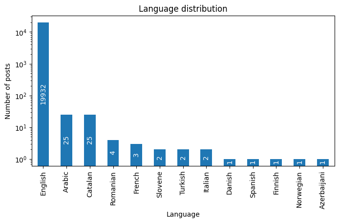
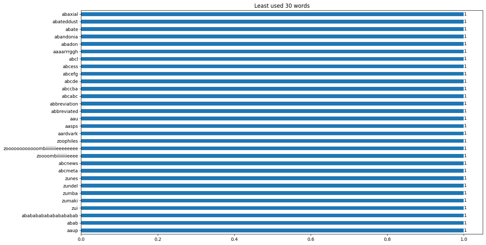
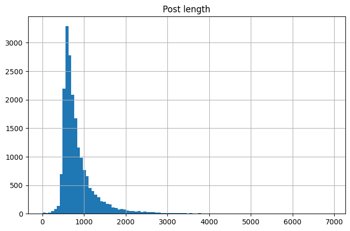

## Preprocessing {#sec:preprocessing}

After the initial data filtering, we proceeded with the preprocessing stage, which is crucial in preparing the data for further analysis. In this phase, we employed various data processing techniques to optimize the dataset for subsequent analysis.

The data preprocessing was carried out in Python using the Pandas library for data manipulation [@reback2020pandas]. Pandas allowed for easy loading of data from the PostgreSQL database, efficient processing and filtering, and saving intermediate results to pickle files.

### Removing Duplicates

The first step in the preprocessing pipeline was to remove duplicate rows, which could distort the analysis. Rows with identical values in both the `body` and `subreddit` columns were considered duplicates. We used the `drop_duplicates` method to address this issue, and the analysis revealed that duplicates represented only 0.48% of the total dataset.

### Balancing and Reducing the Dataset

Next, we focused on balancing and reducing the dataset size. The `sample` method from Pandas was used to ensure an equal number of rows for each subreddit, as illustrated in [@lst:reduce-dataset]. The resulting dataset, comprising 20,000 rows, was better suited for more efficient analysis.

```python
import pandas as pd

dataset_size = 20000
classes = df['subreddit'].unique()
subreddit_dfs = []

for subreddit in classes:
  _df = df[df['subreddit'] == subreddit]
  _df = _df.sample(dataset_size // len(classes))
  subreddit_dfs.append(_df)

df = pd.concat(subreddit_dfs).reset_index(drop=True)
```

: Reducing and balancing the dataset {#lst:reduce-dataset}

### Lexical Analysis

After balancing the dataset, we analyzed the most frequent lexical items in the `body` column using the `CountVectorizer` from the Scikit Learn library [@sklearn2011]. This helped us understand the common terms used in the dataset, as shown in [@fig:top-words-initial]. We also analyzed the length distribution of the posts, which revealed that most posts were around 1,000 characters long, as illustrated in [@fig:post-length-initial].

{#fig:top-words-initial}

{#fig:post-length-initial width=80%}

### Text Cleaning

The next step involved decoding special characters, removing stopwords, and performing lemmatization. Initially, we used the `langdetect` library to filter out non-English entries. However, the results were not always accurate, so we developed an in-house solution using the NLTK library [@bird2009natural]. Our custom function, presented in [@lst:detect-language], checks the occurrence of stopwords in various languages and selects the most likely language based on the highest match count. This method proved to be slightly faster than `langdetect`, which was advantageous for large datasets. After applying this function, the dataset shrank by 0.34%, and the language distribution is shown in [@fig:language-distribution].

```python
import nltk
from nltk.corpus import stopwords

def detect_language(text: str):
  text = text.lower()
  words_set: set[str] = set(nltk.wordpunct_tokenize(text))
  occurences: dict[str, int] = {}

  for lang in stopwords.fileids():
    if lang == 'hinglish':
      # Skip Hinglish, which includes both
      # Hindi and English stopwords
      continue
    common = words_set.intersection(stopwords.words(lang))
    occurences[lang] = len(common)

  return max(occurences, key=occurences.get)
```

: Detecting the language of the text using NLTK and stopwords {#lst:detect-language}

{#fig:language-distribution width=80%}

### Text Preprocessing

After removing non-English entries, we proceeded with decoding special characters, removing stopwords, and lemmatizing the text. These operations were carried out using NLTK, and the `preprocessing` function, shown in [@lst:preprocessing], was applied to clean and process the data. This function performs several tasks:

- Removing URLs and unescaping HTML entities
- Removing stopwords
- Tokenizing the text
- Lemmatizing the tokens based on their part of speech
- Removing non-alphabetic characters

The result of these operations is a cleaned dataset suitable for further analysis.

```python
import nltk
from nltk.corpus import stopwords
from nltk.stem import WordNetLemmatizer

def preprocessing(text: str) -> str:
  sw: list = stopwords.words('english')
  lemmatizer = WordNetLemmatizer()
  pos_dict = {'NOUN': 'n', 'VERB': 'v', 'ADJ': 'a', 'ADV': 'r'}

  # Initial cleaning: remove URLs, unescape HTML entities
  text = unescape(re.sub(r"http(s?)://\S+", '', text.lower()))

  # Remove stop words - first run
  text = [word for word in text.split() if word not in sw]
  text = ' '.join(text)

  # Tokenize the text
  tokens = nltk.word_tokenize(text)
  tokens = nltk.pos_tag(tokens, tagset='universal')

  result = []
  for token, pos in tokens:
    if token not in sw:
      # Map POS tag to first character lemmatize() accepts
      pos = pos_dict.get(pos, 'n')

      # Lemmatize the token
      token = lemmatizer.lemmatize(token, pos)

      # Remove non-alphabetic characters
      token = re.sub(r"[^a-z]", ' ', token).strip()
      if token:
        result.append(token)
  text = ' '.join(result)

  # Remove stop words - third run
  text = [word for word in text.split() if word not in sw]
  return ' '.join(text)
```

: Preprocessing function for text data {#lst:preprocessing}

### Results of Preprocessing

The preprocessing stage significantly cleaned the dataset, as evidenced by the change in the list of most frequent words. After preprocessing, the most common words in the dataset were typical English words like `people`, `make`, and `like`, as shown in [@fig:top-words-preprocessed]. However, we also noticed some unwanted, non-lexical words like `abab` and `zoooombiiiiiiiieeee`, which had not been properly filtered out.

{#fig:top-words-preprocessed}

{#fig:top-words-preprocessed-least}

To address this, we eliminated words that were not present in the Brown Corpus, which significantly cleaned up the dataset. However, some important specialized terms, such as technology-related proper names, were inadvertently removed. To balance between cleaning and preserving important vocabulary, we decided to limit the dataset to the top 10,000 most frequent words, which improved the quality of the data while retaining essential terms.

After this final step, we observed a shift in the distribution of post lengths. The most common post length dropped to around 700 characters, down from the initial 1,000 characters, as shown in [@fig:post-length-removed-nonwords].

{#fig:post-length-removed-nonwords width=80%}
