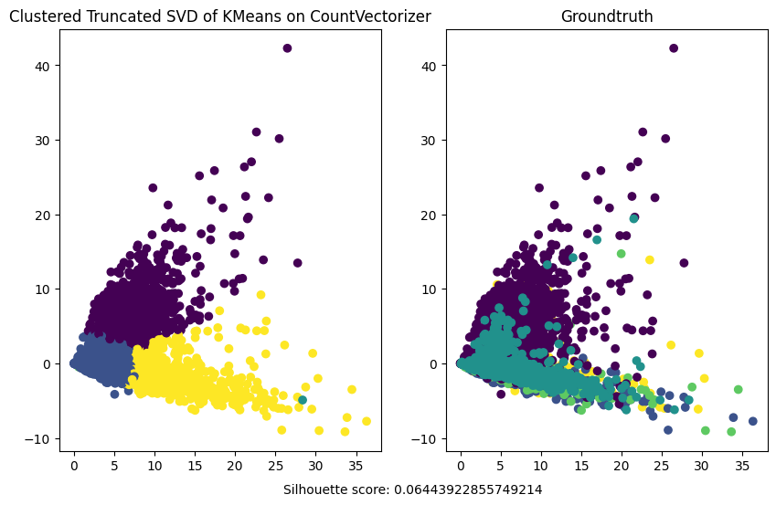
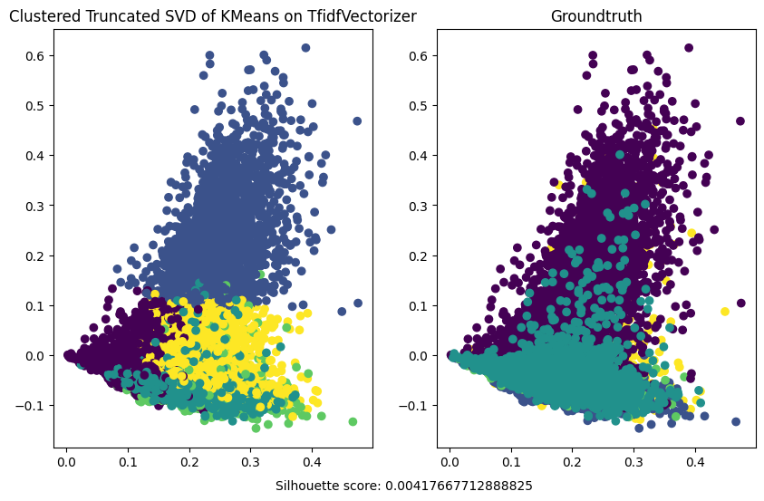

### K-Means clustering

K-Means cluster given data into K distinct groups based on feature similarity. It works by:

1. Initialization: Randomly selecting K cluster centroids.
2. Assignment: Assigning each data point to the nearest centroid.
3. Update: Calculating new centroids as the mean of all points in each cluster.
4. Repeat: Iterating steps 2 and 3 until the centroids stabilize (convergence).

Below we present achieved results for this method, however as previously said they are quite poor.

{#fig:kmeans-count widh=80%}

{#fig:kmeans-tfidf widh=80%}
