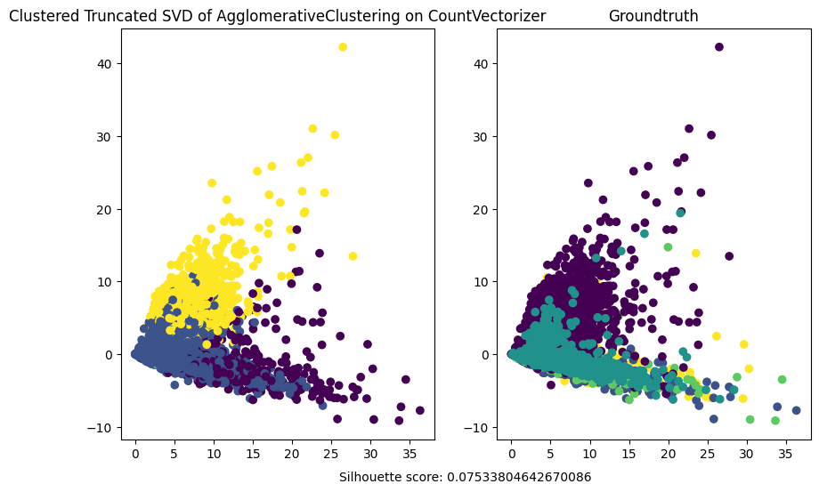

### Agglomerative Clustering

It is a type of hierarchical clustering that builds clusters by iteratively merging smaller clusters into larger ones, starting from individual data points. It is a "bottom-up" approach to clustering.

Algorithm Steps:

1. Initialize: Treat each data point as its own cluster.
2. Compute Distances: Compute pairwise distances (or similarities) between all clusters using a chosen linkage criterion (e.g., single, complete, average).
3. Merge Clusters: Identify and merge the two closest clusters based on the chosen distance metric.
4. Repeat: Continue merging until all data points belong to one cluster or until a predefined number of clusters is reached.

{#fig:agglomerative-count widh=80%}

{#fig:agglomerative-tfidf widh=80%}
