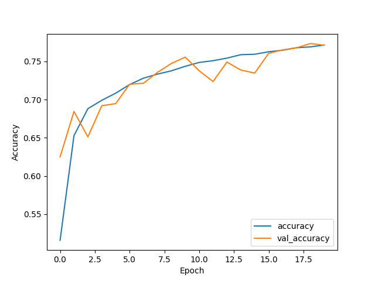

### Neural networks
 
 Neural networks are widely applied method for classification tasks. Specially in natural language processing. In our pipeline we used Eord2Vec pretrained embedding and tested it on two networks. 

 #### Dense Model

| Layer (type)               | Output Shape     | Param #     |
|----------------------------|------------------|-------------|
| embedding_10 (Embedding)   | (None, 1463, 300)| 27,523,800  |
| global_average_pooling1d_7 (GlobalAveragePooling1D) | (None, 300) | 0           |
| dense_24 (Dense)           | (None, 32)      | 9,632       |
| dropout_17 (Dropout)       | (None, 32)      | 0           |
| dense_25 (Dense)           | (None, 32)      | 1,056       |
| dropout_18 (Dropout)       | (None, 32)      | 0           |
| dense_26 (Dense)           | (None, 16)      | 528         |
| dropout_19 (Dropout)       | (None, 16)      | 0           |
| dense_27 (Dense)           | (None, 5)       | 85          |
| **Total params**:          | **27,535,101**  |             |
| **Trainable params**:        | **11,301**      |             |
| **Non-trainable params**:    | **27,523,800**   |             |

{#fig:lstm-learning-curve widh=80%}

{#fig:lstm-confusion-matrix widh=80%}

{#fig:lstm-roc widh=80%}

#### LSTM Model

### Model Summary in Markdown Table

| Layer (type)                 | Output Shape     | Param #     |
|------------------------------|------------------|-------------|
| embedding_1 (Embedding)      | (None, 1463, 300)| 24,379,800  |
| spatial_dropout1d_1 (SpatialDropout1D) | (None, 1463, 300) | 0           |
| bidirectional_3 (Bidirectional) | (None, 1463, 64) | 85,248      |
| dropout_6 (Dropout)          | (None, 1463, 64) | 0           |
| bidirectional_4 (Bidirectional) | (None, 1463, 64) | 24,832      |
| dropout_7 (Dropout)          | (None, 1463, 64) | 0           |
| bidirectional_5 (Bidirectional) | (None, 64)      | 24,832      |
| dropout_8 (Dropout)          | (None, 64)       | 0           |
| dense_1 (Dense)              | (None, 5)        | 325         |
| **Total params**:            | **24,515,037**   |             |
| **Trainable params**:        | **135,237**      |             |
| **Non-trainable params**:    | **24,379,800**   |             |

{#fig:lstm-learning-curve widh=80%}

{#fig:lstm-confusion-matrix widh=80%}

{#fig:lstm-roc widh=80%}