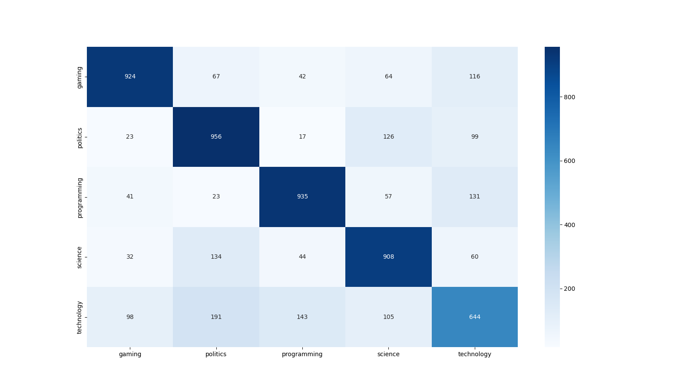

## Hidden Markov Models

A Hidden Markov Model (HMM) is a statistical model used to represent systems that exhibit temporal or sequential characteristics. It is widely applied in fields such as speech recognition, natural language processing, bioinformatics, and pattern recognition.

We decided to apply them as feature extractor for text classification task. We fited model with *tf-idf* vectors and then compute hidden states. Then we passed this hidden states as input to XGBoost classifier. The proposed method resulted with results shown in [@fig:hmm-xgboost-confusion-matrix] and [@fig:hmm-xgboost-roc].

{#fig:hmm-xgboost-confusion-matrix widh=80%}

{#fig:hmm-xgboost-roc widh=80%}
