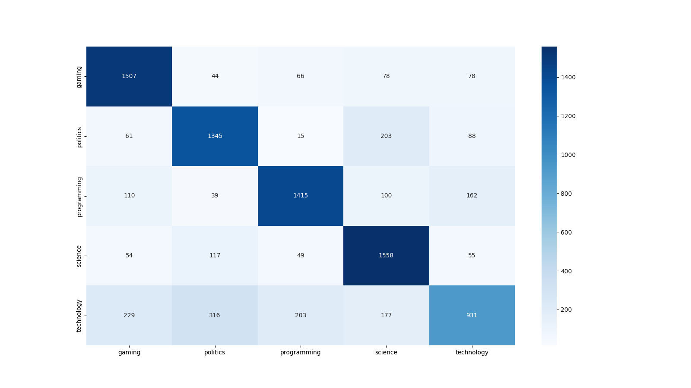

## Dense Model

Neural networks are widely applied method for classification tasks. Specially in natural language processing. In our pipeline we used Word2Vec pretrained embedding and tested it on two networks.

| Layer (type)             | Output Shape      | Param #    |
| :----------------------- | :---------------- | :--------- |
| Embedding                | (None, 1463, 300) | 27,523,800 |
| GlobalAveragePooling1D   | (None, 300)       | 0          |
| Dense                    | (None, 32)        | 9,632      |
| Dropout                  | (None, 32)        | 0          |
| Dense                    | (None, 32)        | 1,056      |
| Dropout                  | (None, 32)        | 0          |
| Dense                    | (None, 16)        | 528        |
| Dropout                  | (None, 16)        | 0          |
| Dense                    | (None, 5)         | 85         |
| **Total params**         | **27,535,101**    |            |
| **Trainable params**     | **11,301**        |            |
| **Non-trainable params** | **27,523,800**    |            |

: Dense model summary {#tbl:dense-model-summary}

{#fig:dense-learning-curve widh=80%}

{#fig:dense-confusion-matrix widh=80%}

{#fig:dense-roc widh=80%}
