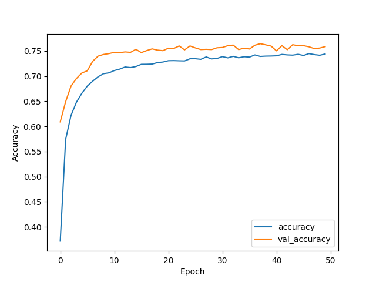

## Dense Model

### Introduction

Neural networks are a widely applied method for classification tasks, especially in natural language processing. Since neural networks require numerical data instead of text, there are many available and commonly used methods for converting text into numerical format. In addition to basic TF-IDF or Bag of Words, more advanced techniques have been proposed in recent years. One of the most popular is word embeddings. Word embeddings map text data into feature space, where the distances between different words can be calculated. These embeddings can be trained on different datasets, and some big tech companies, such as Google, share their best embeddings publicly. One of the most popular and widely used embeddings is Word2Vec. It represents words as vectors in a high-dimensional space, where semantically similar words are located closer together. This approach has revolutionized natural language processing (NLP) by providing a way to effectively capture relationships between words in a numerical format.

**Key Features of Word2Vec:**

1. **Two Architectures:**  
   Word2Vec uses two main training methods:  
   - **Continuous Bag of Words (CBOW):** Predicts a target word based on its surrounding context words.  
   - **Skip-Gram:** Predicts surrounding context words given a target word.  

2. **Semantic Representation:**  
   The embeddings learned by Word2Vec encode semantic relationships, such as:  
   - Analogies (e.g., "king - man + woman $\approx$ queen").  
   - Synonymy (e.g., "fast" and "quick" will have similar vector representations).  

3. **Training Process:**  
   Word2Vec is trained on large text corpora using a shallow neural network to optimize for the prediction of words in their context. The objective is to maximize the probability of observing context words near a target word.

4. **Efficiency:**  
   Word2Vec is highly efficient and can process large datasets to learn high-quality embeddings in relatively short periods.

To ensure we have well-trained embeddings, we used Word2Vec trained on `Google-News-300`.

### Model Architecture

As the basic model, we tested a classical dense model, which is presented below.

| Layer (type)             | Output Shape      | Param #    |
| :----------------------- | :---------------- | :--------- |
| Embedding                | (None, 1463, 300) | 27,523,800 |
| GlobalAveragePooling1D   | (None, 300)       | 0          |
| Dense                    | (None, 32)        | 9,632      |
| Dropout                  | (None, 32)        | 0          |
| Dense                    | (None, 32)        | 1,056      |
| Dropout                  | (None, 32)        | 0          |
| Dense                    | (None, 16)        | 528        |
| Dropout                  | (None, 16)        | 0          |
| Dense                    | (None, 5)         | 85         |
| **Total params**         | **27,535,101**    |            |
| **Trainable params**     | **11,301**        |            |
| **Non-trainable params** | **27,523,800**    |            |

: Dense model summary {#tbl:dense-model-summary}

{#fig:dense-learning-curve width=60%}

### Results

This quite simple architecture allowed us to achieve results at the level of the best classifiers tested previously. The learning curve shown in [@fig:dense-learning-curve] seems very good, with smooth progress, and the model didn't show signs of overfitting (as indicated by the loss curve). The confusion matrix presented in [@fig:dense-confusion-matrix] shows that the model is able to classify the texts of Reddit posts with high accuracy. The ROC curve in [@fig:dense-roc] also confirms the good performance of the classifier.

{#fig:dense-confusion-matrix width=100%}

{#fig:dense-roc width=50%}
